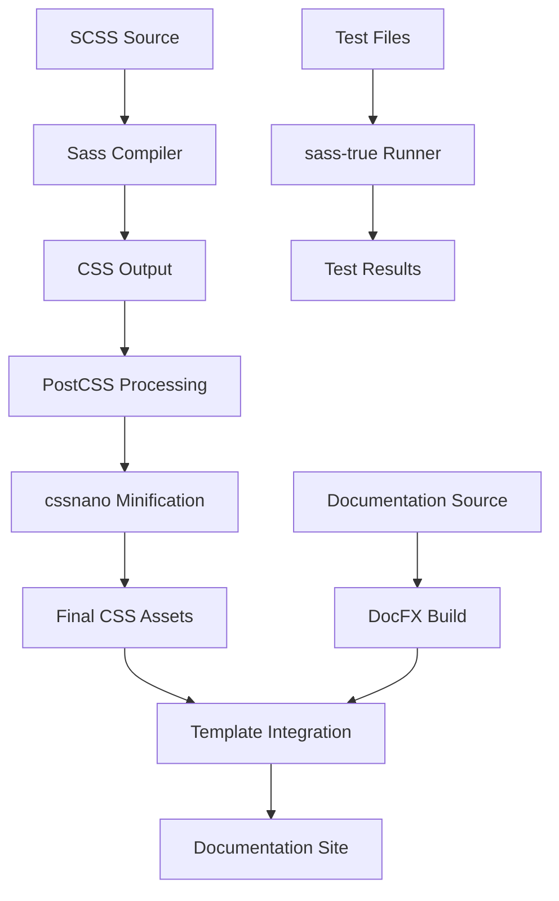

# Accouter Framework Architecture

## Overview

Accouter is an enterprise-grade SCSS framework built on modern architectural principles, emphasizing maintainability, customizability, and developer experience. The architecture demonstrates sophisticated patterns for large-scale CSS framework development.

## Core Architectural Principles

### 1. Modern SCSS Architecture
- **Module System**: Uses `@use`/`@forward` directives avoiding global namespace pollution
- **Dependency Management**: Explicit imports with controlled namespacing
- **Tree Shaking**: Only import what's needed through selective forwarding

### 2. Hybrid CSS System
- **Compile-time Logic**: SCSS functions, mixins, and variables for build-time calculations
- **Runtime Customization**: CSS custom properties for dynamic theming without recompilation
- **Performance Optimization**: Minimal runtime overhead with maximum customization capability

### 3. Layered Component Architecture
```
┌─────────────────┐  ← layouts/     (Page-level composition)
├─────────────────┤  ← helpers/     (Utility classes - orthogonal)
├─────────────────┤  ← grid/        (Layout system - orthogonal)  
├─────────────────┤  ← components/  (Complex UI patterns)
├─────────────────┤  ← forms/       (Form-specific components)
├─────────────────┤  ← elements/    (Semantic HTML styling)
├─────────────────┤  ← base/        (Resets & fundamentals)
├─────────────────┤  ← themes/      (Color systems & variations)
└─────────────────┘  ← configs/     (Variables, functions, mixins)
```

## Module Architecture

### Dependency Hierarchy

The import order in `scss/_index.scss` establishes a strict dependency hierarchy:

1. **configs/** - Foundation layer providing variables, functions, mixins
2. **themes/** - Color systems and theming infrastructure  
3. **base/** - CSS resets and universal foundations
4. **elements/** - Semantic HTML element styling
5. **forms/** - Form component patterns
6. **components/** - Complex UI component library
7. **grid/** - Layout grid system (orthogonal utility)
8. **helpers/** - Utility classes (orthogonal utility)
9. **layouts/** - Page-level composition patterns

### Configuration Layer Architecture

The `configs/` directory implements sophisticated configuration management:

```scss
configs/
├── variables-init.scss     # Base variable definitions
├── variables-derived.scss  # Calculated/computed variables  
├── variables-scss.scss     # Framework-specific logic variables
├── functions.scss          # Utility function library
├── mixins.scss            # Reusable pattern library
├── extends.scss           # Shared selector patterns
├── controls.scss          # Feature flags and configuration
└── _index.scss            # Orchestration layer
```

### CSS Custom Properties System

Advanced theming architecture using decomposed color properties:

```scss
// Color decomposition for runtime manipulation
@function buildHsla($name, $l, $a: 1) {
  $lightness: getVar($name, "", "-l");
  @if ($l) { $lightness: $l; }
  @return hsla(#{getVar($name, "", "-h")}, #{getVar($name, "", "-s")}, #{$lightness}, #{$a});
}

// Variable naming convention: --{prefix}-{component}-{property}
// Example: --accouter-button-bg-color-h (hue)
//          --accouter-button-bg-color-s (saturation)  
//          --accouter-button-bg-color-l (lightness)
```

**Benefits:**
- **Dynamic Theming**: Change individual color properties without recompilation
- **Dark Mode**: Manipulate lightness values for automatic dark theme generation
- **Brand Customization**: Override specific color components for brand alignment
- **Runtime Performance**: No CSS regeneration needed for theme changes

## Build System Architecture

### Multi-Stage Pipeline



### Development Workflow Architecture

Parallel development pipeline using `npm-run-all`:

```bash
# Concurrent processes during development
watch-scss      # SCSS → CSS compilation on file changes
watch-style     # CSS → Documentation template integration  
watch-serve     # Documentation rebuild and serve
watch-browser   # Browser-sync live reload coordination
```

**Benefits:**
- **Immediate Feedback**: Changes reflected in browser within seconds
- **Integrated Workflow**: Code, documentation, and testing unified
- **Parallel Processing**: Multiple build stages run simultaneously
- **Smart Rebuilds**: Only affected components recompile

## Testing Architecture

### sass-true Integration

Comprehensive testing system supporting multiple patterns:

```scss
// Functional testing pattern
@include test-module('Component [function]') {
  @include test('Should perform expected calculation') {
    @include assert-equal(actual-result, expected-result);
  }
}

// BDD-style testing pattern  
@include describe('Component [function]') {
  @include it('Should behave as specified') {
    @include assert-equal(actual-result, expected-result);
  }
}
```

**Test Coverage Areas:**
- **Function Validation**: SCSS function outputs match specifications
- **Color Calculations**: HSL manipulations produce expected results
- **Variable Resolution**: CSS custom property generation works correctly
- **Mixin Outputs**: Generated CSS matches expected patterns

## Component Architecture Patterns

### Inverted Triangle CSS (ITCSS) Adaptation

The framework follows ITCSS principles with modern enhancements:

1. **Generic** (base/): Universal styles, resets, normalize
2. **Elements** (elements/): Bare HTML elements styling
3. **Objects** (grid/, layouts/): Design patterns, layout primitives
4. **Components** (components/, forms/): Designed UI pieces
5. **Utilities** (helpers/): Helper classes, overrides

### Atomic Design Integration

Components follow atomic design methodology:

- **Atoms**: Basic HTML elements (elements/)
- **Molecules**: Simple UI components (components/basic/)  
- **Organisms**: Complex UI sections (components/complex/)
- **Templates**: Page layouts (layouts/)
- **Pages**: Specific implementations (documentation examples)

## Performance Architecture

### Optimization Strategies

1. **Selective Importing**: Only load required components
2. **CSS Custom Properties**: Runtime theming without recompilation
3. **Critical CSS Path**: Base styles loaded first, enhancements progressive
4. **Minification Pipeline**: Production builds automatically optimized
5. **Cache Optimization**: Separate CSS files for better browser caching

### Bundle Size Management

```scss
// Modular importing allows selective inclusion
@use "scss/components/buttons";     // Only button styles
@use "scss/components/forms";       // Only form styles
@use "scss/layouts/dashboard";      // Only dashboard layout

// Alternative: Full framework import
@use "scss";                        // Everything included
```

## Customization Architecture

### Theme Override System

Three levels of customization:

1. **CSS Custom Properties**: Runtime theme changes
```css
:root {
  --accouter-primary-h: 220;
  --accouter-primary-s: 70%;
  --accouter-primary-l: 50%;
}
```

2. **SCSS Variable Override**: Compile-time customization
```scss
@use "accouter/scss" with (
  $primary-color: #custom-color,
  $border-radius: 8px
);
```

3. **Component Extension**: Custom component patterns
```scss
@use "accouter/scss/components/buttons" as buttons;

.custom-button {
  @include buttons.base-button;
  // Custom modifications
}
```

## Quality Assurance Architecture

### Multi-Level Validation

1. **Build Validation**: SCSS compilation must succeed
2. **Test Validation**: sass-true unit tests must pass  
3. **Documentation Validation**: DocFX build must complete
4. **Style Validation**: EditorConfig and formatting standards
5. **Integration Validation**: Template CSS integration verified

### Continuous Integration Pipeline

```bash
npm run clean          # Remove previous builds
npm run build          # Full SCSS compilation
npm test              # Run sass-true test suite
npm run docfx          # Build documentation
npm run watch          # Development workflow validation
```

## Extensibility Architecture

### Plugin System Design

Framework designed for extensibility:

1. **Component Plugins**: Add new UI components
2. **Theme Plugins**: Create custom color schemes  
3. **Utility Plugins**: Add helper class libraries
4. **Layout Plugins**: Contribute layout patterns

### API Design Principles

- **Consistent Naming**: Predictable function and variable names
- **Composable Patterns**: Mix and match components freely
- **Override Points**: Clear customization boundaries
- **Backward Compatibility**: Semantic versioning for API changes

## Conclusion

The Accouter architecture represents modern CSS framework design, balancing:

- **Developer Experience**: Sophisticated tooling and workflows
- **Performance**: Optimized build pipeline and runtime efficiency  
- **Maintainability**: Clear separation of concerns and modular structure
- **Flexibility**: Multiple customization levels without complexity
- **Quality**: Comprehensive testing and validation systems

This architectural foundation supports both rapid prototyping and enterprise-scale applications while maintaining code quality and developer productivity.