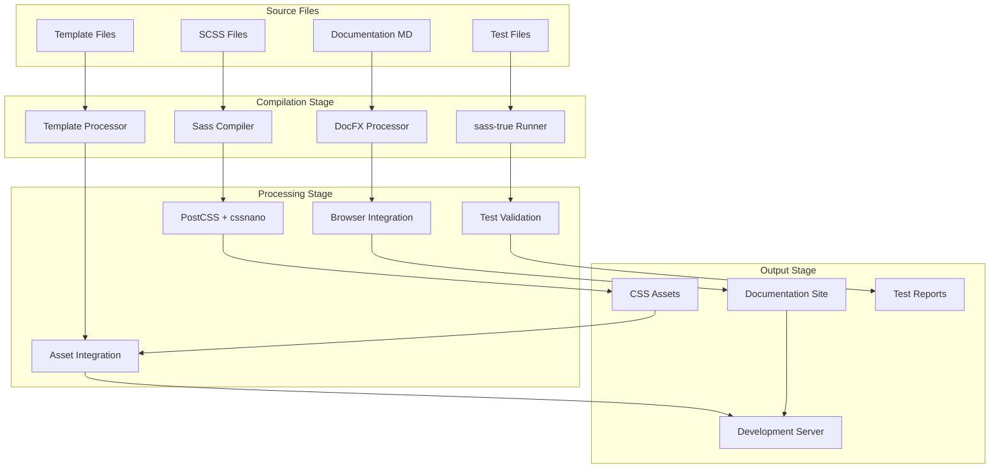

# Build & Workflow Architecture

## Overview

Accouter's build system implements a sophisticated multi-stage pipeline designed for modern development workflows. The architecture supports parallel processing, live reloading, integrated testing, and automated documentation generation.

## Build Pipeline Architecture

### Multi-Stage Compilation Pipeline



## Development Workflow Architecture

### Parallel Watch System

The development workflow runs four parallel processes using `npm-run-all`:

```bash
# npm run watch executes these concurrently:
watch-scss      # SCSS compilation monitoring
watch-style     # CSS-to-template integration  
watch-serve     # Documentation rebuild & serve
watch-browser   # Browser-sync live reload
```

### Process Interaction Model

```javascript
// Conceptual workflow coordination
const WorkflowOrchestrator = {
  processes: {
    'watch-scss': {
      triggers: ['**.scss'],
      outputs: ['css/accouter.css', 'css/accouter.min.css'],
      dependents: ['watch-style', 'watch-browser']
    },
    'watch-style': {
      triggers: ['css/**.css'],  
      outputs: ['templates/accouter/public/**.css'],
      dependents: ['watch-serve']
    },
    'watch-serve': {
      triggers: ['templates/**', 'docs/**', '**.md'],
      outputs: ['_site/**'],
      dependents: ['watch-browser']
    },
    'watch-browser': {
      triggers: ['_site/**'],
      outputs: ['http://localhost:8080'],
      dependents: []
    }
  }
};
```

## Build Command Architecture

### Production Build Pipeline

```bash
# npm run build
├── npm run build-scss     # SCSS → CSS compilation
└── npm run build-minify   # CSS → Minified CSS
```

**Detailed Process:**
1. **SCSS Compilation**: `sass --style=expanded --source-map accouter.scss css/accouter.css`
2. **CSS Minification**: `postcss css/accouter.css --use cssnano --output css/accouter.min.css`

### Documentation Build Pipeline  

```bash
# npm run docfx
├── npm run docfx-style    # Copy CSS assets to templates  
└── npm run docfx-build    # Generate documentation site
```

**Detailed Process:**
1. **Asset Integration**: `cpy css/accouter.* templates/accouter/public/ --flat`
2. **Site Generation**: `docfx build docfx.json --logLevel error`

### Complete Workflow Pipeline

```bash  
# npm start (full pipeline)
├── npm run clean          # Clean previous builds
├── npm run build          # Full CSS compilation
├── npm run docfx-style    # Integrate CSS into templates
└── npm run docfx          # Generate documentation
```

## Nodemon Configuration Architecture

### File Watching Strategy

Each nodemon configuration targets specific file patterns:

#### SCSS Watch Configuration (nodemon-scss.json)
```json
{
  "watch": ["scss/**/*.scss", "accouter.scss", "test.scss"],
  "ext": "scss",
  "ignore": ["css/**", "_site/**", "node_modules/**"],
  "delay": 500
}
```

#### Style Watch Configuration (nodemon-style.json)  
```json
{
  "watch": ["css/**/*.css"],
  "ext": "css", 
  "ignore": ["_site/**", "node_modules/**"],
  "delay": 200
}
```

#### Documentation Watch Configuration (nodemon-serve.json)
```json
{
  "watch": ["templates/**", "docs/**", "*.md"],
  "ext": "md,yml,json,html",
  "ignore": ["_site/**", "node_modules/**"],
  "delay": 1000
}
```

### Optimized Watch Performance

- **Selective Monitoring**: Each watcher targets specific file types
- **Smart Ignoring**: Exclude build outputs and dependencies  
- **Debounced Rebuilds**: Delays prevent rapid-fire rebuilds
- **Parallel Execution**: Independent processes don't block each other

## Browser-Sync Integration

### Live Reload Architecture

```javascript
// Browser-sync configuration (conceptual)
const browserSyncConfig = {
  server: {
    baseDir: '_site/',
    index: 'index.html'
  },
  port: 8080,
  files: [
    '_site/**/*.html',
    '_site/**/*.css', 
    '_site/**/*.js'
  ],
  reloadDelay: 300,
  reloadDebounce: 500
};
```

**Features:**
- **Multi-Device Testing**: Synchronized browsing across devices
- **Hot CSS Injection**: CSS changes without page reload
- **Form Persistence**: Maintains form state during reloads
- **Scroll Synchronization**: Coordinated scrolling across browsers

## Testing Integration Architecture

### sass-true Integration

```bash
# npm test
sass test.scss  # Compiles and runs SCSS unit tests
```

**Test Execution Flow:**
1. **Test Discovery**: Loads `test.scss` entry point
2. **Module Loading**: Imports test modules via `@forward`
3. **Test Execution**: Runs sass-true test functions
4. **Result Validation**: Compilation success indicates test pass
5. **Error Reporting**: SCSS compilation errors indicate test failures

### Test Architecture Patterns

```scss
// Test module structure
test/
├── array.scss              # Example test module
├── functions.scss           # Function testing (future)
├── mixins.scss              # Mixin testing (future)  
└── components.scss          # Component testing (future)

// Test entry point coordination
// test.scss
@charset "utf-8";
@forward "test/array";
@forward "test/functions";
@forward "test/mixins";
@forward "test/components";
```

## Build Optimization Architecture

### Asset Management Strategy

```bash
# Asset output structure
css/
├── accouter.css           # Development version with source maps
├── accouter.css.map       # Source map for debugging  
└── accouter.min.css       # Production minified version

_site/
├── index.html             # Generated documentation
├── assets/                # Documentation assets
│   ├── accouter.css       # Integrated framework CSS
│   └── docs.css           # Documentation-specific styles
└── api/                   # Generated API documentation
```

### Performance Optimization Techniques

1. **Source Maps**: Enable debugging in development
2. **Minification**: Reduce production bundle size
3. **Asset Fingerprinting**: Enable long-term caching (future)
4. **Tree Shaking**: Remove unused CSS (via selective imports)

## Clean & Maintenance Architecture

### Build Artifact Management

```bash
# npm run clean
├── npm run clean-css      # rimraf css/
└── npm run clean-docfx    # rimraf _site/
```

**Clean Strategy:**
- **Selective Cleaning**: Remove only build artifacts
- **Preserve Sources**: Never delete source files
- **Dependency Safety**: Clean before major rebuilds
- **CI/CD Integration**: Always clean in automated builds

### File System Organization

```
accouter/
├── src/                   # Source files (never cleaned)
│   ├── scss/              # SCSS framework source
│   ├── docs/              # Documentation source  
│   ├── templates/         # DocFX templates
│   └── test/              # Test source files
├── build/                 # Generated files (cleaned)
│   ├── css/               # Compiled CSS
│   └── _site/             # Documentation site
└── config/                # Build configuration (never cleaned)
    ├── nodemon-*.json     # Watch configurations
    ├── docfx.json         # Documentation config
    └── package.json       # Build scripts
```

## Error Handling & Recovery

### Build Failure Strategies

```bash
# Error handling in build scripts
set -e                     # Exit on first error
trap cleanup EXIT          # Always run cleanup
```

**Recovery Mechanisms:**
1. **Graceful Degradation**: Continue partial builds when possible
2. **Error Isolation**: One process failure doesn't stop others  
3. **Automatic Retry**: Watch processes automatically restart
4. **Detailed Logging**: Clear error messages for debugging

### Development Error Handling

- **SCSS Compilation Errors**: Show in browser via browser-sync
- **Documentation Errors**: Display in console with line numbers
- **Test Failures**: Stop build with clear error indication
- **Watch Process Crashes**: Automatic restart with logging

## CI/CD Integration Architecture

### Build Validation Pipeline

```bash
# Validation sequence for CI/CD
npm run clean              # Ensure clean build environment
npm run build              # Verify SCSS compiles correctly
npm test                   # Run unit test suite  
npm run docfx              # Verify documentation builds
```

### Quality Gates

1. **Compilation Gate**: SCSS must compile without errors
2. **Test Gate**: All sass-true tests must pass
3. **Documentation Gate**: DocFX build must succeed  
4. **Style Gate**: EditorConfig compliance (future)
5. **Performance Gate**: Bundle size limits (future)

## Future Architecture Enhancements

### Advanced Build Features

1. **Bundle Analysis**: CSS bundle size tracking and optimization
2. **Critical CSS**: Automatic critical path CSS extraction
3. **Progressive Enhancement**: Automated fallback generation
4. **Performance Budgets**: Automated performance regression detection

### Development Experience Improvements

1. **HMR Integration**: Hot module replacement for SCSS
2. **Visual Diff**: Automated visual regression testing  
3. **Component Preview**: Isolated component development
4. **Design Token Sync**: Integration with design systems

### Production Optimizations

1. **Asset Fingerprinting**: Cache-busting for production deployments
2. **CDN Integration**: Automated asset deployment to CDN
3. **Compression**: Automated gzip/brotli compression  
4. **Monitoring**: Runtime performance monitoring integration

The build and workflow architecture provides a robust foundation for efficient development, comprehensive testing, and reliable production deployments while maintaining excellent developer experience.